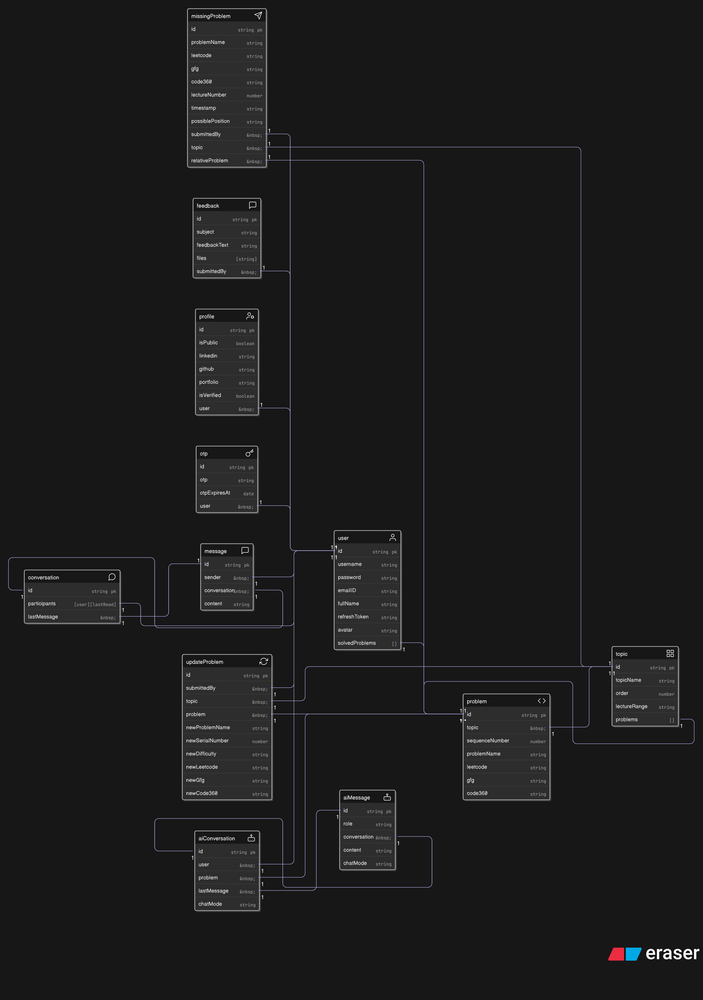

# Final Database Design

The entire application is powered by a MongoDB database, structured into several interconnected models using Mongoose. The final design reflects the evolution of the project, separating concerns to ensure scalability and maintainability.

The schema is designed around a central `User` model, with distinct models for tracking progress, managing real-time chat, and handling AI-powered conversations. This modular approach was critical for implementing advanced features like unread message counts and temporary AI chat history.

Below is the final entity-relationship diagram for the database.

### Key Models:

* **User & Profile:** The core of the authentication and user information system.
* **Topic & Problem:** The main models for the DSA progress tracker.
* **Conversation & Message:** A scalable, two-model system for the real-time, user-to-user chat.
* **AiConversation & AiMessage:** A dedicated, separate system for all AI-powered chat modes, featuring a TTL index for automatic deletion of temporary chats.
* **Feedback, UpdateProblem MissingProblem:** Models for collecting user feedback and community contributions.