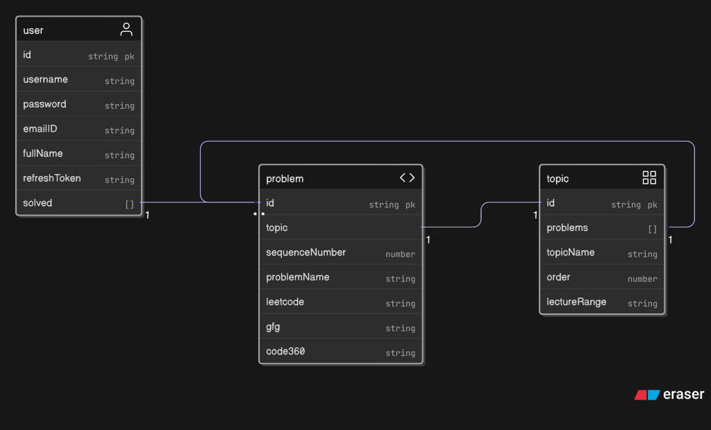

# 1.2 The Crucible of Data Modeling: From Naive Schema to Scalable Design

With the initial data collected, the next critical challenge was designing a database schema that was both optimal and scalable. This led to a "battle of decisions" between two initial, seemingly straightforward ideas for modeling the many-to-many relationship between users and the problems they solve.

### Initial (Flawed) Approaches

1.  **Embedding Users in Problems:** The first idea was to have a `Problem` model that contained an array of `userId`s for every user who had solved it.
2.  **Embedding Problems in Users:** The second, converse approach was to have a `User` model that contained an array of `problemId`s for every problem they had solved.

### The Analysis: Avoiding Future Bottlenecks

While simple to implement, a deeper analysis revealed that both of these designs contained a critical flaw: **unbounded arrays**. As the user base and the number of solved problems grew, these arrays could become massive, leading to two major issues:
* **Performance Degradation:** Updating large arrays in MongoDB (adding or removing an ID) is a computationally expensive operation that can significantly slow down the database.
* **The 16MB Document Limit:** An active user or a popular problem could eventually have an array so large that the entire document exceeds MongoDB's 16MB size limit, causing the application to fail.

> This early identification of potential **technical debt** was a pivotal moment. It represented a conscious shift from a short-term "make it work" mentality to a long-term "make it last" engineering mindset. The decision was made to invest time upfront in a more robust design, a foresight that proved crucial for later features like the "Find a Fellow Coder" engine, which would have been nearly impossible to build on the initial embedded designs.

### The Final, Scalable Solution

The breakthrough came with the adoption of a normalized, **three-model architecture**, which is the best practice for handling many-to-many relationships in a NoSQL database like MongoDB.

The final design consists of three distinct and decoupled models: `User`, `TopicSection`, and `Problem`. The relationship between a user and the problems they've solved is managed not by embedding, but by storing an array of references to `Problem` documents within the `User` model. This relational approach within a NoSQL context provided the scalable and performant cornerstone upon which the entire application was built.

