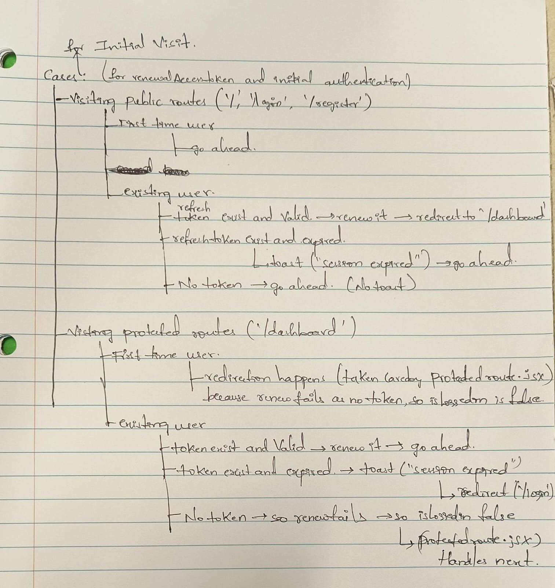

# 3.2 Engineering a Persistent Session: The Initial Authentication Flow

A critical feature for a seamless user experience is the initial authentication check on app load. The motivation for this feature was to address a common issue: any code change that triggers a hot-reload or a manual page refresh wipes the in-memory Redux state, forcing users to log in repeatedly. The goal was to implement a "silent renewal" process, enabling persistent sessions and reducing friction.

---

### Planning for Initial Authentication and Silent Renewal

Implementing this feature required careful consideration of multiple edge cases and user flows. The main scenarios considered were:

- **Visiting Public Routes (`/`, `/login`, `/register`):**
    - **First-time user:** Allow access as normal.
    - **Existing user:**
        - If a valid refresh token exists, automatically renew the access token and redirect to the dashboard.
        - If the refresh token exists but is expired, display a "Session expired" notification and allow access.
        - If no token exists, allow access without any notification.
- **Visiting Protected Routes (`/dashboard`):**
    - **First-time user:** If no token is present, the renewal fails, `isLoggedIn` remains `false`, and the `ProtectedRoute` component redirects to the login page.
    - **Existing user:**
        - If a valid refresh token exists, renew the access token and allow access.
        - If the token is expired, display a "Session expired" notification and redirect to login.
        - If no token exists, renewal fails, `isLoggedIn` remains `false`, and the protected route logic handles the redirect.

This logic was designed to handle both initial visits and refresh-token-based checks. It is separate from the backend's `verifyToken` middleware, which uses the access token for endpoint security.

---

### Backend and Frontend Coordination

To support this flow, both backend and frontend required updates:

- **Backend:**
    - A new `renewAccessToken` endpoint was created. A key insight was that `jwt.verify()` throws an error if the token is expired, rather than returning `null`. This allowed for robust error handling using a `try...catch` block, enabling the backend to send custom error messages for different scenarios.
    - An additional `/getCurrentUser` endpoint was added. After a successful token renewal, this endpoint fetches the full user object using the user ID extracted from the verified token.

- **Frontend:**
    - On initial app load, a `useEffect` in the root `App.jsx` dispatches the `renewAccessToken` thunk. If renewal is successful, the app then calls `/getCurrentUser` to populate the Redux state with the user's data, restoring the session without requiring a new login.
    - If the refresh token is expired, the frontend displays a "Session expired" toast notification and allows the user to proceed as a guest or log in again.

#### Thought Process and Implementation Details

Several cases were considered and the `authSlice.js` was modified to handle them. During the renewal process, it became clear that the backend's `renewAccessToken` endpoint only returned new tokens (access and refresh), but not the user object. To address this, a new `/getCurrentUser` endpoint was created. This endpoint uses the user ID extracted from the verified token (after a successful renewal) to fetch and return the current user's data to the frontend.

This approach ensures that, after a refresh or hot-reload, the application can silently restore the user's session if possible, or gracefully handle expired sessions with clear feedback. The renewal process is triggered on the first app load via a `useEffect` in React. If renewal is successful, the user data is fetched and the dashboard is refreshed. If the refresh token is expired, the backend's `jwt.verify()` throws an error, which is caught and handled to send a custom error message. The frontend then uses this message to decide whether to show a toast notification or not, providing a clear and user-friendly experience.

---

> **Deep Dive: The Two-Token Authentication Strategy**
>
> - **Access Token (Short-Lived):** A JWT sent with every API request to prove identity. Kept short-lived (e.g., 1 day) to minimize security risks.
> - **Refresh Token (Long-Lived):** Used only to obtain a new access token. Stored securely in an `httpOnly` cookie, making it inaccessible to client-side JavaScript. When the access token expires, the frontend uses the refresh token to silently get a new one, providing a seamless, persistent session for the user.

This implementation transformed the application from a simple tool into a robust platform, providing a secure and user-friendly authentication experience with persistent sessions and smooth transitions between public and protected routes.