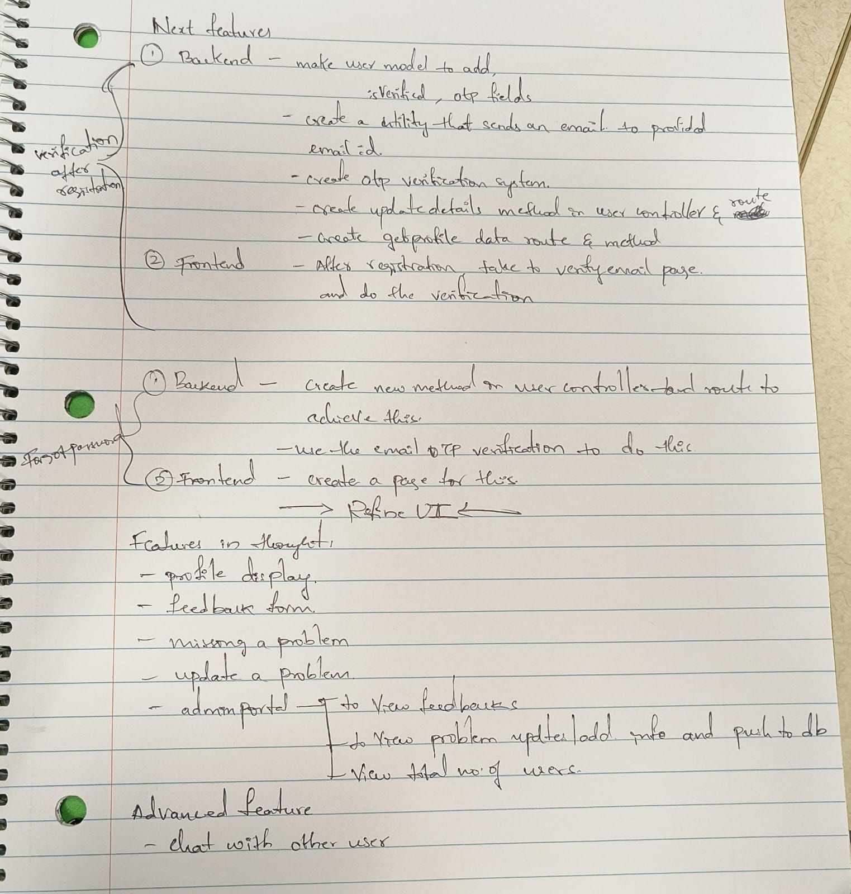

# 4.1 Enhancing Problem Data with Difficulty Levels

With the core MVP features in place, the first major enhancement was to enrich the problem data to provide a more valuable user experience. The goal was to add a `difficulty` level (Easy, Medium, Hard) to each of the 222 problems, which would enable the implementation of powerful "Smart Filters" on the dashboard.

### The Data Enrichment Process

This was a significant undertaking that required a great deal of manual effort. I personally reviewed every single one of the 222 problem links across platforms like LeetCode and GeeksforGeeks to accurately classify its difficulty. This data was compiled into a structured text file, ready to be integrated into the automated seeding pipeline.

### A Careful Data Migration

Adding a new field to the core `Problem` model required a full database migration. This was handled with a professional and cautious approach:
1.  First, to prevent data corruption for existing users, I manually unmarked all solved problems. This was a critical step because the re-seeding process would generate new, unique `_id`s for every problem.
2.  Next, the database was wiped.
3.  Finally, the server was restarted. The automated `checkAndSeedDb` function detected the empty database and re-populated it from the updated JSON file, which now included the new `difficulty` field for every problem.

This careful process ensured a seamless transition to the new, richer dataset and enabled the development of the advanced filtering capabilities on the dashboard.

### Planning the Next Steps

With a solid, feature-rich platform now fully developed, this was also a moment to step back and plan the future evolution of the application. The following roadmap was created to outline the next set of features that would be built.

