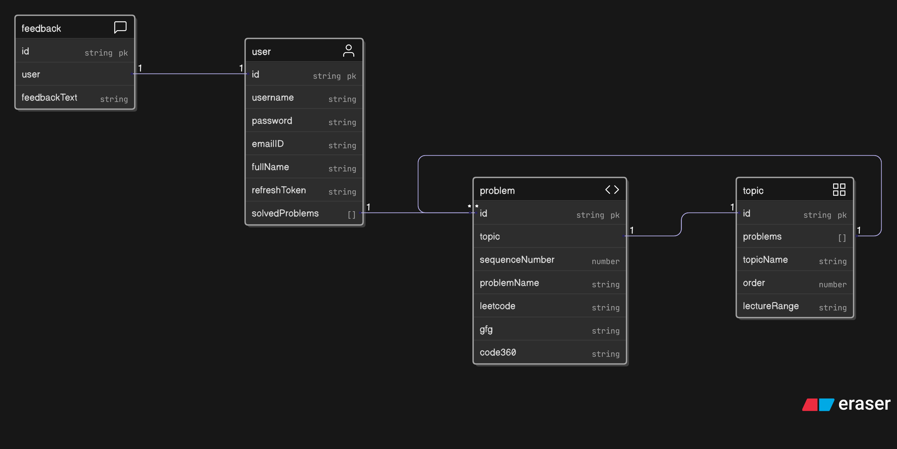

# 5.1 Building the Feedback System & A Major State Refactor

The first step in transforming the application from a personal tool into a community platform was to build a feedback system. This feature was designed as a protected route, ensuring that only logged-in users could submit feedback. This was a deliberate architectural choice, made with a future **Admin Portal** in mind, where administrators could view feedback and directly identify the user who submitted it, enabling features like sending direct follow-up notifications.

Here is the updated database design

### The Architectural Discovery: A Global State Problem

While building the Redux slice for the new feedback feature, I noticed a recurring and inefficient pattern in the existing codebase: every single slice (`authSlice`, `problemsSlice`, etc.) had its own `error` and `success` state fields. This was redundant, as all these states were being used for the same purpose: to display a global toast notification from the root `App.jsx` component.

### The Great Refactor: A Centralized `errorSuccessSlice`

This realization prompted a significant and proactive refactoring of the entire Redux state. The solution was to centralize all notification logic into a single, dedicated slice: **`errorSuccessSlice.js`**.

This new slice is simple but powerful. It holds the global `error` and `success` messages and exposes three simple actions: `setError`, `setSuccess`, and `clearErrorSuccess`.

This refactor had a profound impact on the entire application:
* **Decoupling:** It completely decoupled the application's core data state (like `auth.user`) from the transient UI state of notifications.
* **Separation of Concerns:** Each async thunk was simplified. Its job is now only to manage its own data and loading states, while delegating the responsibility for user notifications to the new global slice by dispatching `setError` or `setSuccess` in its `catch` or `try` blocks.

This refactoring, sparked by the creation of a simple feedback form, resulted in a much cleaner, more scalable, and more maintainable Redux architecture, perfectly aligning with the "single source of truth" principle.
