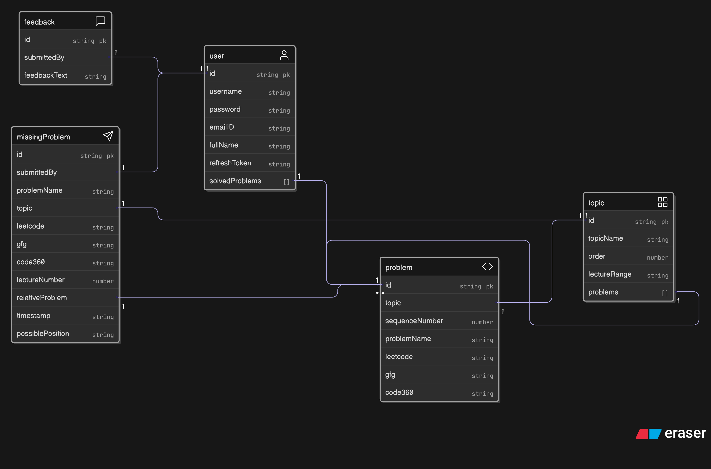

# 5.2 Crowdsourcing Data - The "Missing Problem" Feature

To further empower the community, a dedicated feature was built to allow users to contribute directly to the platform's data quality. This took the form of a highly structured "Missing a Problem" submission form.

### A User-Centric and Admin-Friendly Design

The feature was designed with both the end-user and the future administrator in mind.
* **For the User:** It provides a clear, dedicated channel to report a specific issue, rather than a generic feedback box. The form is interactive, allowing users to select a topic and then choose a problem to specify the position of the missing one.
* **For the Admin:** The form is designed to capture all the necessary, structured data—`topicName`, `problemName`, multiple platform links, `lectureNumber`, and `possiblePosition`. This makes the process of verifying and adding the new problem from a future admin portal incredibly efficient, potentially a one-click action.

A graceful fallback was also included. For more complex submissions, like an entirely new topic, a link directs the user to the general feedback form, ensuring all types of user contributions can be captured.

### Scalability and Modularity

- The "Missing Problem" feature is modular and self-contained:
    - A new backend model stores missing problem requests.
    - Backend controllers and routes handle form submissions.
    - A dedicated frontend page/component presents the form.
    - New service and Redux state manage API calls.
- This modular approach supports both current manual workflows and future admin automation.

### A Key Debugging Insight: `null` vs. Empty String

During implementation, I encountered the eighth major bug of the project. The form included an optional `relativeProblem` field. The frontend was sending an empty string (`''`) when this field was left blank, but the backend Mongoose schema was expecting either a valid `ObjectId` or `null`. This mismatch caused a validation error.

This was a critical lesson in data integrity: **an empty string is not the same as `null`**. The frontend logic was corrected to explicitly send `null` for optional fields, ensuring the data sent to the backend always matched the schema's expectations. This small fix was a key insight into the importance of strict data typing across the full stack.