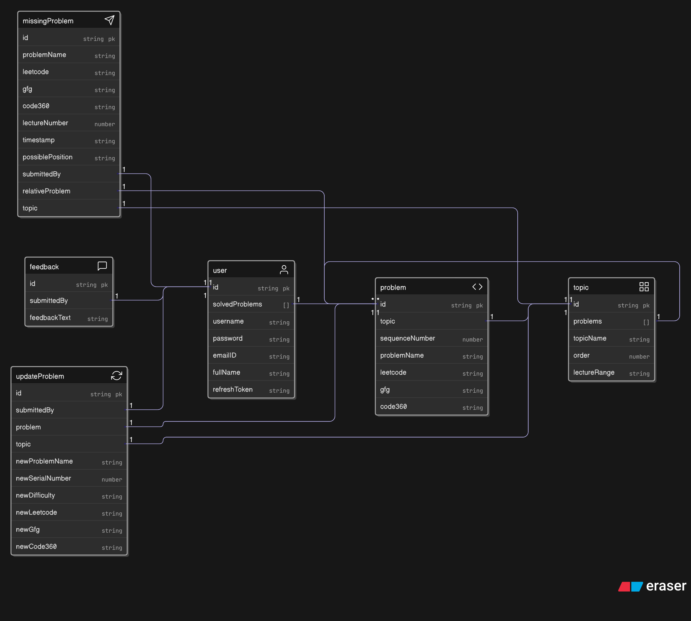
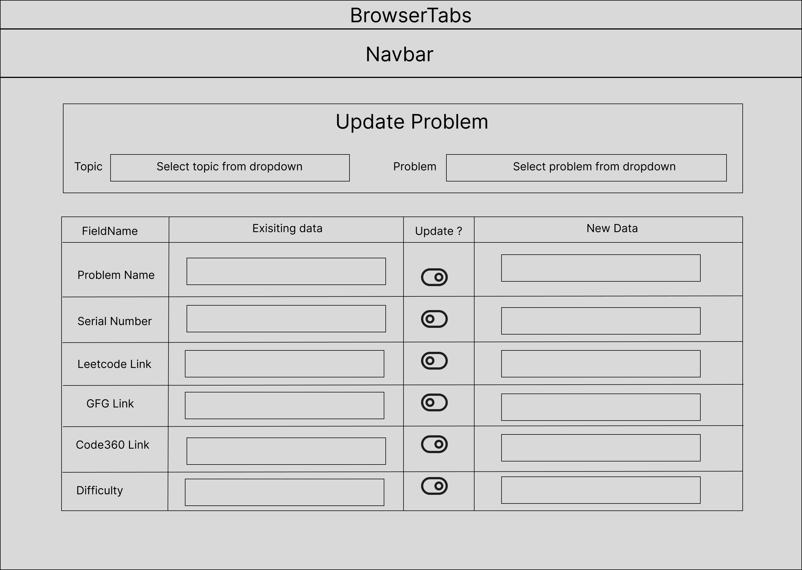

# 5.3 The Epitome of Crowdsourcing: The Update Problem Feature

This feature was introduced to address the potential for errors in the initial, manually collected problem dataset. The original data was compiled by reviewing all 150 videos, recording problem names and links in an Excel sheet, and then converting that data to JSON. Given the manual nature of this process, there was a possibility of mistakes. To improve data accuracy and leverage community expertise, a crowdsourcing mechanism was implemented, allowing users to suggest corrections to the core problem data.

---

## User-Centric and Secure Design

- **Access Control:**  
  The update form is a protected route, accessible only to authenticated users.
- **User Experience:**  
  The UI was designed in Figma to be clear and intuitive. The form workflow is as follows:
    - The user selects a topic from a dropdown menu.
    - Based on the topic, a second dropdown menu appears for selecting the problem.
    - The form displays two columns:
        1. **Existing Data:** Shown in disabled input fields.
        2. **New Data:** Empty fields for the user to provide suggested changes.
    - This side-by-side layout allows users to easily compare and update only the fields that require correction.
- **Database Update:**  
  The backend only accepts a submission if at least one new field is different from the existing data, preventing unnecessary database writes.



---

## Frontend Design and Implementation

- **Figma Prototyping:**  
  Basic designs for the feature were created in Figma to guide the UI/UX.
  


- **Dynamic Form Rendering:**  
  The frontend uses a modular React pattern:
    - An array of configuration objects (`fields`) defines the form structure.
    - The form is rendered by mapping over this array, with conditional logic for different input types (e.g., dropdown for "difficulty").
    - The `updateFields` state object manages which fields are enabled for editing, toggled by checkboxes.
    - The `toggleUpdate` function updates `updateFields` and clears form data for unchecked fields, ensuring only intended changes are submitted.
    - The submit button is disabled unless a problem is selected and the form is not submitting, improving UX.
    - The `handleSubmit` function cleans the form data, converting empty strings to `null` before sending to the backend.

---

## Backend: Validation Logic and Data Integrity

A critical requirement was to ensure that only meaningful updates are processed. The backend controller (`updateProblem.controller.js`) includes comprehensive validation:

- **Validation Steps:**
    - Checks for required fields: `submittedBy`, `topic`, `problem`.
    - Ensures at least one new field is provided and different from the existing data.
- **Complex Conditional Logic:**  
   For the first time in many years, the logic for this feature was so intricate that it was executed and tested on paper before coding. The challenge was to ensure that if every field is null, an error is already thrown earlier, but now the requirement was: if at least one field is not null and at least one field value is different from the existing one, proceed to save to the database; otherwise, throw an error. This led to multiple iterations and careful use of `&&`, `||`, and ternary operators to arrive at a robust solution.

  The core logic uses a chain of ternary operators and logical operators to verify that at least one field is different:

  ```javascript
  if ((newProblemName ? newProblemName.trim() === existingProblem.problemName : true) &&
      (newSerialNumber ? newSerialNumber == existingProblem.sequenceNumber : true) &&
      (newDifficulty ? newDifficulty === existingProblem.difficulty : true) &&
      (newLeetcode ? newLeetcode.trim() === existingProblem.leetcode : true) &&
      (newGfg ? newGfg.trim() === existingProblem.gfg : true) &&
      (newCode360 ? newCode360.trim() === existingProblem.code360 : true)) {
      throw new ApiError(400, "changes must be different from the existing problem");
  }
  ```

  This logic ensures that if all provided fields are either empty or identical to the existing values, the update is rejected.  
  The use of `==` for `newSerialNumber` addresses a real-world bug where the frontend sends numbers as strings, highlighting the importance of type awareness across the stack.

---

## Real-World Lessons: Type Coercion and the Value of TypeScript

During frontend development, a bug was discovered: submitting a new `sequenceNumber` with the same value as the existing one was not caught by the validation. The root cause was JavaScript's type coercion—HTML forms send numbers as strings, while the database stores them as numbers. The strict equality (`===`) failed, but loose equality (`==`) worked. This experience underscored the importance of type safety and the potential value of TypeScript for preventing such issues.

## API Testing and Validation

- The feature was thoroughly tested using Postman to ensure that only submissions with at least one changed field are accepted.
- Submissions with all fields identical to the existing data are correctly rejected.

## UI Component and Library Choices

- The UI leverages a table-based structure for clarity.
- Multiple UI libraries were evaluated (Material UI, Chakra UI, React UI), but compatibility and feature requirements led to the adoption of Flowbite for the toggle feature, as it provided the necessary components without requiring a paid license.

## Summary

This feature exemplifies a robust, community-driven approach to data accuracy. The combination of secure access, thoughtful UX design, rigorous backend validation, and dynamic frontend logic ensures that only meaningful, user-verified updates are processed. The implementation demonstrates advanced React patterns, careful state management, and a strong understanding of full-stack development challenges, including type safety and real-world data handling.