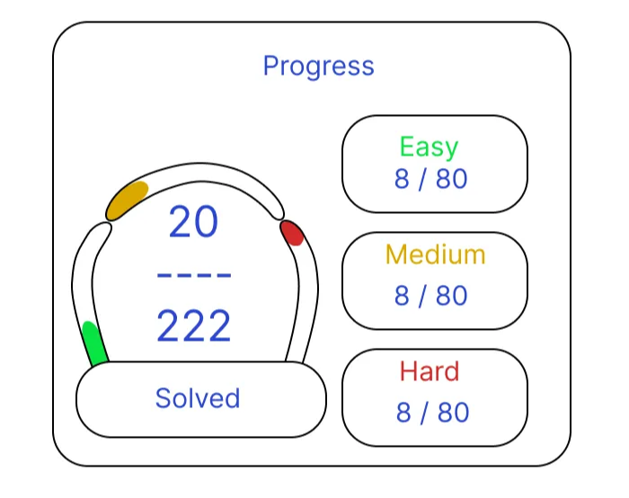
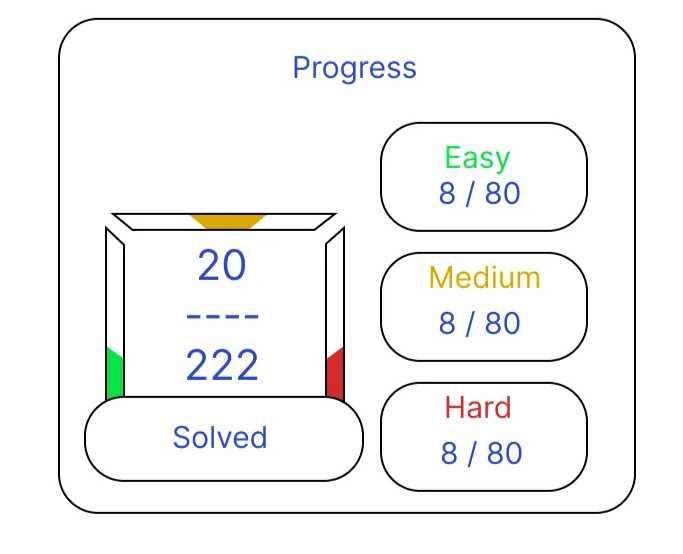
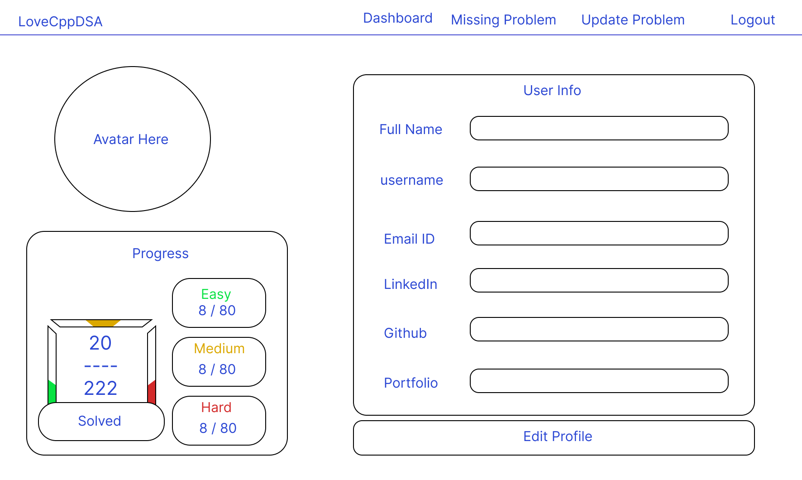
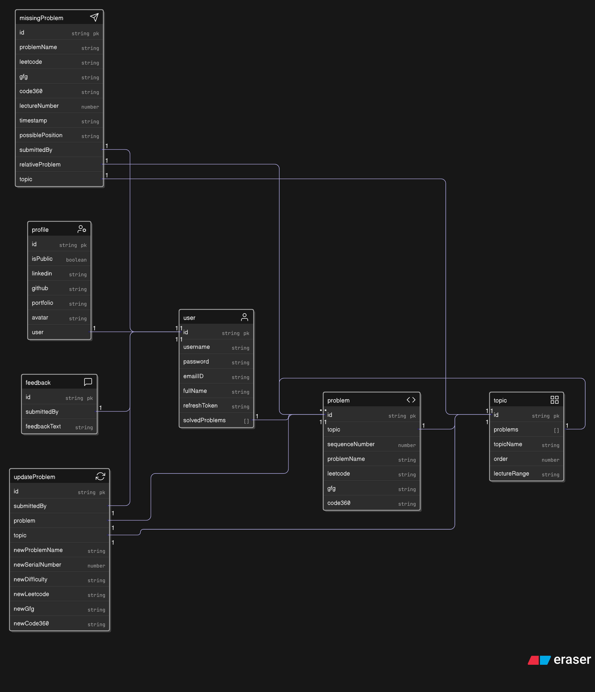

# 6.1 Architecting the Profile Page

The development of the user profile page involved extensive decision-making, UI/UX exploration, and a significant backend refactor to support a scalable and maintainable architecture.

---

## The Battle of Designs: A UI/UX Deep Dive

The process began with a full day dedicated to UI/UX design in Figma. The initial goal was to create a profile page that was both informative and visually engaging. Multiple design iterations were explored:

- **First Design:**  
  The first concept focused on displaying user progress in a visually appealing way. The design included a progress bar and summary statistics, aiming for clarity and motivation.

  

- **Second Design:**  
  After further consideration, a new layout was created, refining the visual hierarchy and improving the separation of information.

  

- **Final Design Decision:**  
  The final design separated the profile experience into two distinct parts:
  1. A clean, visually appealing **Profile Page** for displaying user information and progress summary.
  2. A dedicated **Edit Profile Page** for updating personal details and, in the future, managing application settings such as dark mode or notification preferences.

  

  The Edit Profile page was planned with two sections: one for editing user details, and another for updating settings. Future settings were considered, including dark mode, toggles for making the profile public, showing contributions, and granular privacy controls (e.g., whether to show submitted feedback, missing problems, or updates only to the user or to others).

---

## Architectural Decisions: Data Modeling and System Design

A key challenge was deciding how to store and manage additional profile fields such as `linkedin`, `github`, and `portfolio` URLs. The initial plan was to add these fields directly to the existing `User` model. However, after careful analysis, this approach was reconsidered for several reasons:

- **Performance:**  
  The `User` model is accessed for every authenticated action, including frequent operations like login and token renewal. Adding large, infrequently-used profile data would slow down these critical flows.

- **Separation of Concerns:**  
  Profile information (like social links) is only needed when viewing a profile, not during authentication or dashboard rendering.

- **System Design Evolution:**  
  A more efficient and scalable approach is to create a separate `Profile` model. This model stores all public-facing information, while the core `User` model remains lean and focused on authentication.

  The proposed architecture:
  - **User Model:** Contains only essential authentication data.
  - **Profile Model:** Stores richer, public-facing information, including social links and an `isPublic` flag for privacy control.
  - **Settings Model (planned):** Will house user-specific settings, such as dark mode and privacy toggles, allowing for future expansion without bloating the other models.

  This separation allows for:
  - **Efficiency:** Authentication remains fast, as only the lean `User` model is used for frequent operations.
  - **Scalability:** New profile or settings fields can be added without impacting authentication performance.
  - **Privacy:** The `isPublic` flag on the `Profile` model provides a clear mechanism for controlling what data is visible to others.

  Example usage flows:
  - When a user logs in, only the `User` model is accessed to display the dashboard.
  - When viewing a profile, the `Profile` model is queried, and, if needed, the `Settings` model is used for additional preferences.
  - For public profile views, the application checks the `isPublic` flag before displaying any information, ensuring privacy is respected.

---

## Final UI and Database Schema

The final UI for the profile page reflects this architecture, providing a clean separation between viewing and editing, and supporting future extensibility.

The updated database schema illustrates the normalized structure, with clear relationships between the `User`, `Profile`, and (future) `Settings` models:

