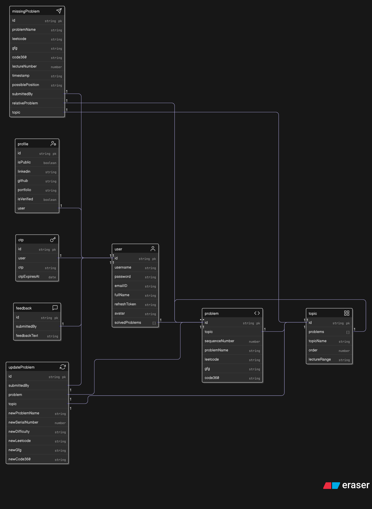

# 6.3 The Great Database Refactor

While designing the "Edit Profile" feature, I had a critical realization. The existing database schema, while functional, was not optimized for the new features and security requirements I had planned. This led to a proactive and significant decision: to undertake a complete revamp of the database design, even though the core application was already working.

### The Motivation: Security, Performance, and Scalability

The primary driver for the refactor was a forward-looking approach to the application's architecture.

1.  **Performance:** The user's `avatar` was stored in the `Profile` model. However, the avatar needed to be displayed globally in the sidebar on every page load. The current design would have required an extra database query on every single page. Moving the `avatar` to the core `User` model would make it instantly available after login, significantly improving performance.
2.  **Separation of Concerns:** The `isVerified` (for email) and OTP fields were stored in the `User` model. However, these are not related to a user's core authentication. A user can be logged in without being verified. To clean up the `User` model, the decision was made to:
    * Move `isVerified` to the `Profile` model, as it's a profile-related status.
    * Move the temporary `otp` and `otpExpiresAt` fields into their own dedicated `Otp` model, keeping the main `User` model clean of transient data.
3.  **Enhanced Security:** The new design would require an OTP verification for any sensitive action, such as changing a password or email address. This separate `Otp` model was the key to enabling this second factor of authentication.

### The Implementation Journey and a Key Debugging Lesson

The refactor was a massive undertaking that required changes across numerous controllers, routes, and services. A key architectural decision was to keep all OTP-related logic within the `user.controller.js`. Although a separate controller was considered, the deep dependency on the `User` model made a single, cohesive controller the more logical and maintainable choice.

The most challenging part was debugging the new `Otp` model. Initial attempts to link it via the user's `email` field failed because a Mongoose reference (`ref`) works most reliably with an `ObjectId`. After several failed registration attempts, the bug was traced back to this incorrect reference.

The final, working solution was to link the `Otp` model to the `User` model via the user's `_id`. This required refactoring the `registerUser` controller to first create the user, get their `_id`, and *then* create the associated OTP document. This hands-on debugging experience was a critical lesson in the nuances of data modeling and relationships in Mongoose.

### Intentional Design: Email Verification Bypass

A deliberate design decision was made regarding the registration and verification flow. The system is designed so that if a user registers and exits the application before entering the OTP, their record is still created—even before email verification is complete. This approach was chosen after considerable brainstorming.

The rationale is that, upon returning to the application, the user’s profile can clearly indicate if their email is not verified. This can be communicated visually, such as displaying a message below the email field or showing a red frame around the avatar. This design ensures that users are aware of their verification status and can complete the process at their convenience, while also allowing the application to manage unverified accounts in a user-friendly way.
