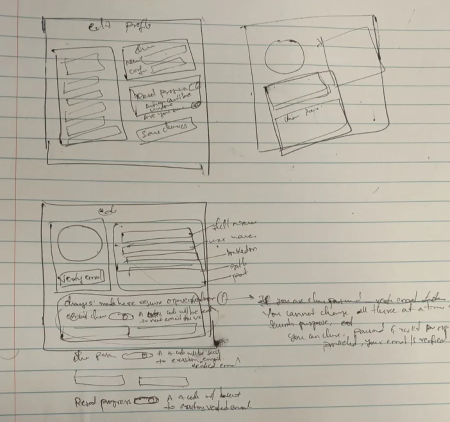
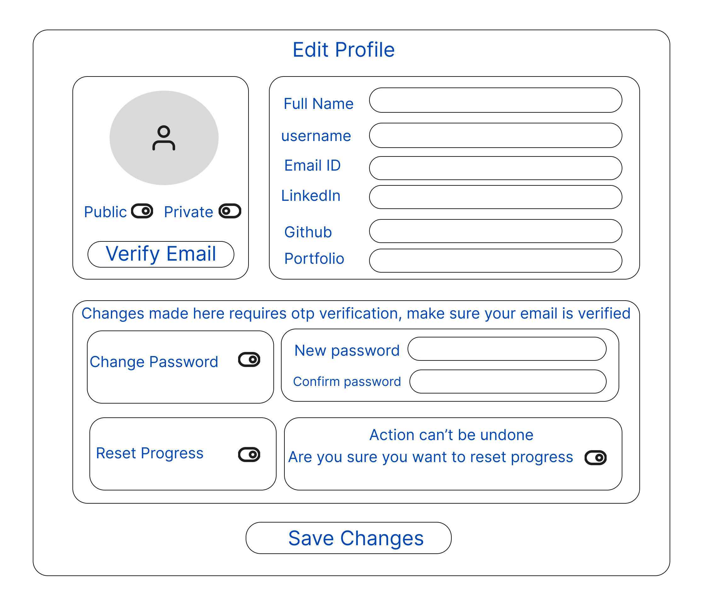

# 6.4 Phase 1 of Developing the Edit Profile Page

The development of the "Edit Profile" feature was a significant milestone, involving extensive planning, consideration of numerous user scenarios, and the implementation of both robust backend logic and a sophisticated frontend architecture. This section documents the entire process, highlighting the technical and design decisions made to ensure a secure, user-friendly, and maintainable solution.

### Planning and Design Process

The initial phase required a deep exploration of all possible user cases, edge scenarios, and UI/UX patterns. Multiple design iterations were considered, each evaluated for usability, security, and maintainability. The process included:

- **Scenario Mapping:** Careful consideration of every way a user might interact with the profile editing feature, including changing basic information, updating sensitive data like passwords, and handling incomplete or invalid input.
- **UX Exploration:** Multiple UI/UX flows were sketched and evaluated to ensure the process would be intuitive and secure for users.
- **Notes and Documentation:** Detailed notes were kept throughout, documenting requirements, edge cases, and technical constraints.

### Finalized UI Design

After extensive iteration, a final UI design was selected for the Edit Profile page, balancing clarity, security, and ease of use.

### Backend Implementation: Secure and Efficient

The backend was engineered to provide a secure and performant foundation for the Edit Profile feature:

- **Efficient Validation:**  
  The `updateProfileData` controller performs a single, optimized database query to check for duplicate usernames or emails, minimizing database load and preventing race conditions.
- **Conditional Updates:**  
  Only the fields provided by the user are updated. `Promise.all` is used to perform parallel updates to the `User` and `Profile` models, maximizing performance.
- **Robust Error Handling:**  
  Comprehensive `try...catch` logic is in place, including specific handling for Mongoose `ValidationError`, ensuring that users receive clear and actionable error messages.
- **OTP Verification for Sensitive Actions:**  
  For sensitive changes (such as password updates), a fresh OTP verification is required. This adds a critical layer of security, protecting users even if their session is left unattended.

### Frontend Implementation: Modular and User-Centric

The frontend architecture was designed to be modular, maintainable, and highly responsive to user needs:

- **Multi-Step Form:**  
  The Edit Profile page is implemented as a multi-step form, separating concerns such as profile updates and password changes. This approach guides users through complex actions in manageable steps.
- **Component Composition:**  
  The UI is broken down into smaller, reusable components (e.g., `EmailInput`, `OtpVerification`, `NewPasswordInput`, and a modular `Toggle` component). This modularity promotes code reuse and simplifies maintenance.
- **Dynamic Rendering:**  
  A `fields` array is used to dynamically render form fields, making the code DRY (Don't Repeat Yourself) and easy to extend.
- **Localized State Management:**  
  Local component state (e.g., `updateFields`, `formData`, `passwordData`, toggle states) is used to manage which input fields are enabled and to track form progress. This avoids unnecessary complexity in the global Redux store and keeps UI logic close to where it is used.
- **Data Integrity:**  
  On submission, a `cleanedFormData` object is created, converting empty strings to `null` to ensure backend compatibility and prevent schema mismatches.
- **Asynchronous Logic:**  
  Functions such as `handleSubmit`, `finalSubmit`, and `handleSubmitOtpVerification` are structured to handle asynchronous API calls cleanly, providing robust error handling and user feedback.

### Security and User Experience

- **OTP Flow:**  
  The two-step OTP process for sensitive actions (send OTP, then verify) enhances security and provides a clear, user-friendly experience.
- **Code Reuse:**  
  Utilities like `generateOTP` and `sendEmail` are reused, demonstrating good software engineering practices.
- **Redux Integration:**  
  Redux is used for API call management and to track the state of the update process, ensuring consistency across the application.
