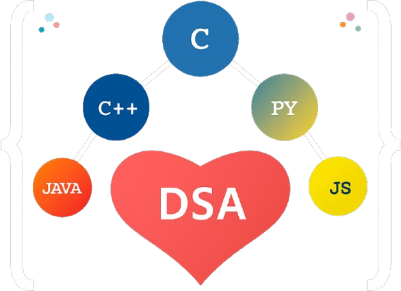

# 7.1 Designing a Visual Identity - The Logo and Favicon

Every memorable application needs a strong visual identity. The first step in the UI revamp was to create a unique logo and favicon that captured the essence of the project.

### The Concept

The core idea was to visually represent the fusion of love for problem-solving with the fundamental concepts of computer science. The vision was to create a design that incorporated a **binary tree**, various **programming language symbols**, a **heart icon**, and the letters **"DSA."**

### The Process: AI-Assisted Design

To bring this concept to life, I leveraged modern AI image generation tools. The detailed prompt was provided to several different AI models, which produced a variety of creative interpretations. After selecting the strongest design, I used **Photopea**, a powerful online photo editing tool, to refine the final assets.

This process of combining a clear creative vision with AI tools and hands-on design work resulted in a unique and meaningful logo and favicon for the LoveCppDSA platform.

**Final Logo:**

