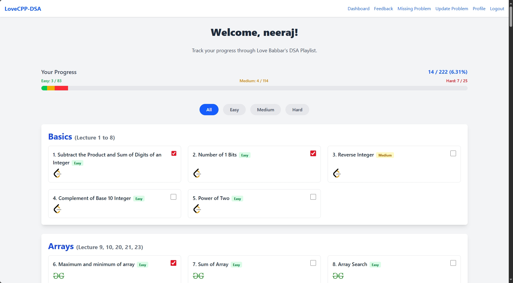
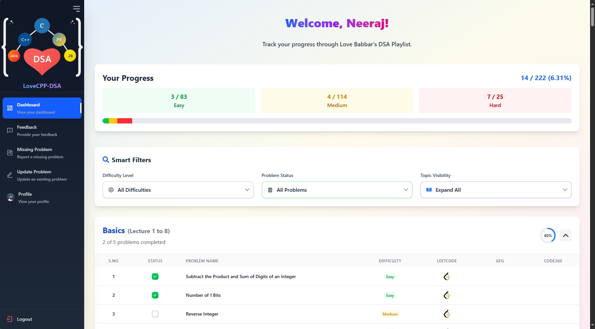
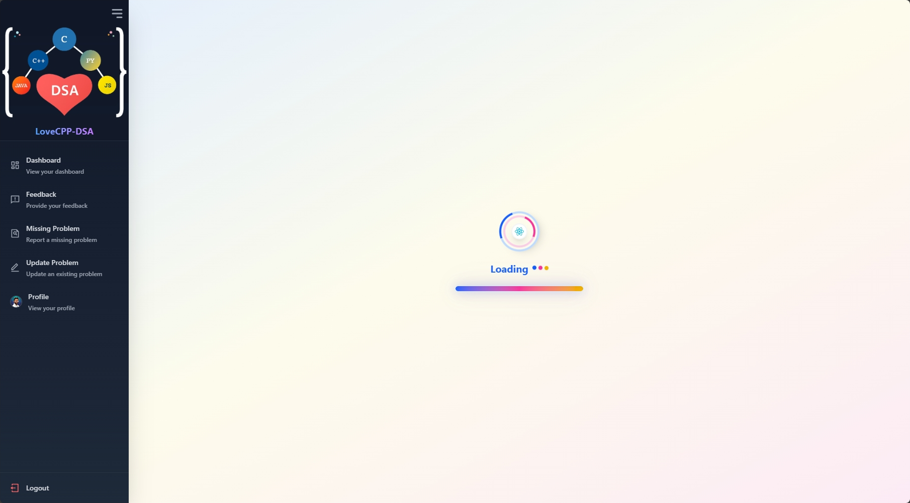

# 7.2 A Visual Overhaul: Redesigning all the pages with AI Assistance

A key part of the UI revamp was to revisit and elevate the design of the application's core pages. With the help of AI-powered tools like GitHub Copilot, I was able to rapidly prototype and implement a more modern, visually engaging, and "eye-pleasing" user interface.

This process was a powerful lesson in the capabilities of AI as a development partner. By providing clear design prompts, I could generate high-quality, modern component structures in minutes, which were then manually refined and integrated into the existing application.

### The Dashboard Page

The dashboard is the heart of the application. Its design was transformed from a simple, functional table into a vibrant, data-rich hub.

**Before:**

**After:**

### The Loading Page

Even the application's loading screen was given a significant visual upgrade to provide a more polished and professional experience during initial authentication checks.

**Before:**

**After:**

and more ....