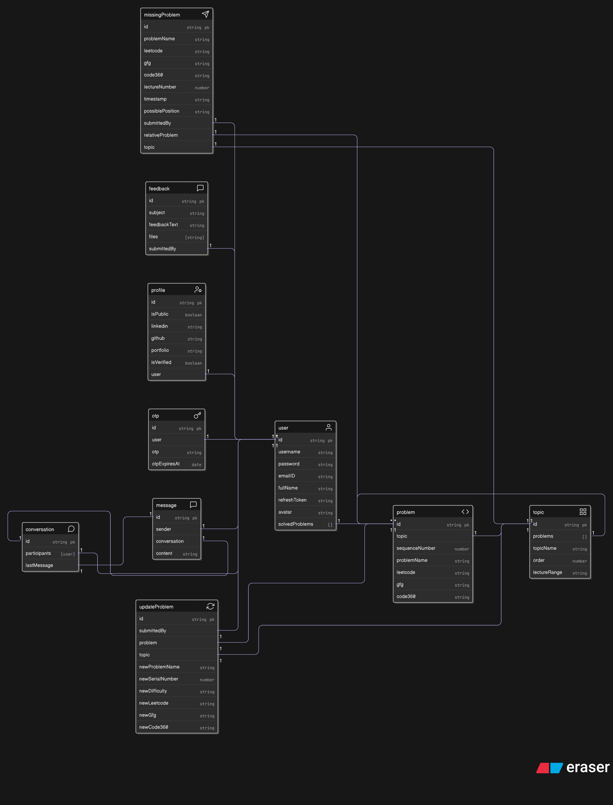

# 8.2 Integrating Socket.IO and Designing a Scalable Schema

With the core vision established, the next phase was to build the technical foundation for real-time chat. This involved two critical, parallel efforts: integrating the Socket.IO server into the backend and designing a database schema that could scale to handle millions of messages.

---

## Integrating the Socket.IO Server

Socket.IO is not a standalone server; it is a library that must be attached to an existing HTTP server. In this application, the Express.js backend already uses a built-in Node.js HTTP server to handle REST API routes. The goal was to make that same server also listen for WebSocket connections, allowing both REST and WebSocket communication on the same port.

A helpful analogy: the Express server is a building with many doors. Some doors are for REST API endpoints (e.g., `/users/loginUser`, `/problems/getAllproblems`). Socket.IO adds new doors for WebSocket connections (e.g., `/socket.io`). This enables both types of communication to run simultaneously on the same port.

The basic server setup involves just a few lines of code to create a Socket.IO instance and attach it to the existing HTTP server object.

### Debugging the Socket Connection

During integration, the **next major bug** was encountered. All frontend services were using `localhost:3000/api/v1/` as the base URL, and this same address was initially used for the socket connection. This led to connection failures. After reviewing documentation, it became clear that if the frontend and backend are not running on the same address and port, the frontend must explicitly specify the backend socket server address, and CORS origin must be configured on the backend. The solution was to create a new environment variable, `VITE_BACKEND_SOCKET_URL='http://localhost:3000/'`, and use it for the socket connection. This immediately resolved the issue, and the frontend showed a successful connection status.

---

## The Great Schema Debate: From Array to Scalable Models

The initial schema design considered storing an array of message objects directly inside a single "conversation" document. While intuitive, this approach is problematic for scalability and performance. Storing an unbounded array of messages in a single document can lead to severe issues, including exceeding MongoDB's 16MB document size limit and degraded performance as the array grows.

The solution was to adopt a **two-model, normalized architecture**, which is the industry standard for scalable chat applications:

1. **Conversation Model:** A lightweight "header" document containing only the participants and a reference to the last message.
2. **Message Model:** Each message is stored as its own document, linked back to its parent conversation.

This design, combined with a compound index (`{ conversation: 1, createdAt: -1 }`) on the `Message` model, ensures efficient querying and sorting of messages, regardless of conversation length.

---

## The Scalable Chat Model Design

### 1. Conversation Model

Tracks the participants in a chat and references the most recent message.

```js
// src/models/Conversation.model.js
import mongoose, { Schema, model } from 'mongoose';

const conversationSchema = new Schema(
    {
        participants: [
            {
                type: Schema.Types.ObjectId,
                ref: 'User',
                required: true,
            },
        ],
        lastMessage: {
            type: Schema.Types.ObjectId,
            ref: 'Message',
            default: null,
        },
    },
    {
        timestamps: true,
    }
);

export const Conversation = model('Conversation', conversationSchema);
```

### 2. Message Model

Stores each individual message as a separate document.

```js
// src/models/Message.model.js
import mongoose, { Schema, model } from 'mongoose';

const messageSchema = new Schema(
    {
        conversation: {
            type: Schema.Types.ObjectId,
            ref: 'Conversation',
            required: true,
        },
        sender: {
            type: Schema.Types.ObjectId,
            ref: 'User',
            required: true,
        },
        content: {
            type: String,
            required: true,
            trim: true,
        },
    },
    {
        timestamps: true,
    }
);

// Create a compound index for efficient querying and sorting
messageSchema.index({ conversation: 1, createdAt: -1 });

export const Message = model('Message', messageSchema);
```
<details>
<summary>**How the Two-Model Design Works**</summary>

A common point of confusion is how message order is maintained and how the `lastMessage` field is used. The `Conversation` model acts as the group chat container, listing participants and referencing only the most recent message for UI preview purposes. The `Message` model represents each individual text bubble, with a `createdAt` timestamp that serves as the definitive order for messages.

However, it can be confusing to see how these two models work together in practice, especially when considering how messages are linked, how the `lastMessage` field is used, and how message order is preserved. Let's break down the logic and address these questions in detail.

### Analogy: Group Chat on Your Phone

Think of the **`Conversation` document as the group chat itself**—the container that defines *who* is in the chat.

- `_id`: Unique ID for the group chat.
- `participants`: List of user IDs in the group.
- `lastMessage`: **Not** the only message—just a shortcut or pointer to the most recent message, useful for UI previews.

The **`Message` document** is like each individual text bubble you send or receive in that group chat.

- `_id`: Unique ID for the message.
- `conversation`: The group chat this message belongs to.
- `sender`: Who sent the message.
- `content`: The actual text.

### Example Scenario

**Conversation A:**
- `participants`: [user1, user2, user3, user4, user5]
- `lastMessage`: id of the most recent message

**Message Documents:**
- Each message has a `conversation` field pointing to Conversation A, a `sender`, `content`, and a `createdAt` timestamp.

When a user opens a chat, the frontend fetches the `Conversation` data and then requests the most recent messages for that conversation, sorted by `createdAt`. Pagination is used to efficiently load older messages as needed.

If user2 and user3 chat privately, a new `Conversation` document is created with only those two participants. Their messages are stored as separate `Message` documents linked to this new conversation.

### Addressing the Confusion: How Does Message Order Work?

A key question is: If the `Conversation` model only stores the last message, how do we know the order of all previous messages?

The answer: **The order is managed by the `createdAt` timestamp in each `Message` document, not by the `Conversation` model.**

#### Step-by-Step Example

1. **Conversation is created** between user and friend1.
    - `Conversation` document:  
      - `_id`: "convo_123"
      - `participants`: [`userId`, `friend1Id`]
      - `lastMessage`: `null`
    - `Message` collection: empty for this conversation.

2. **friend1 sends "hi user":**
    - New `Message` document is created:
      - `_id`: "msg_A"
      - `conversation`: "convo_123"
      - `sender`: `friend1Id`
      - `content`: "hi user"
      - `createdAt`: `2025-08-17T10:40:00Z`
    - `Conversation`'s `lastMessage` is updated to `"msg_A"`.

1. **User replies "hi friend":**
    - Another `Message` document is created:
      - `_id`: "msg_B"
      - `conversation`: "convo_123"
      - `sender`: `userId`
      - `content`: "hi friend"
      - `createdAt`: `2025-08-17T10:40:05Z`
    - `Conversation`'s `lastMessage` is updated to `"msg_B"`.

2. **Frontend displays chat history:**
    - The frontend queries all messages for the conversation, sorted by `createdAt`.
    - Messages are displayed in the correct order:
        1. `{ _id: "msg_A", content: "hi user", createdAt: "....10:40:00Z" }`
        2. `{ _id: "msg_B", content: "hi friend", createdAt: "....10:40:05Z" }`

The `lastMessage` field is just a convenient shortcut for the UI (for example, to show a preview of the latest message in a chat list), while the full message history and order are reconstructed from the `Message` collection using timestamps.
</details>

---

### Summary: One-to-Many Relationship

- **One** `Conversation` can have **many** `Message` documents linked to it.
- Messages are not stored as an array in the conversation, avoiding document size limits and performance issues.
- Each message points back to its conversation, and order is maintained via timestamps.

This design is robust, scalable, and aligns with industry best practices for real-time chat systems.

