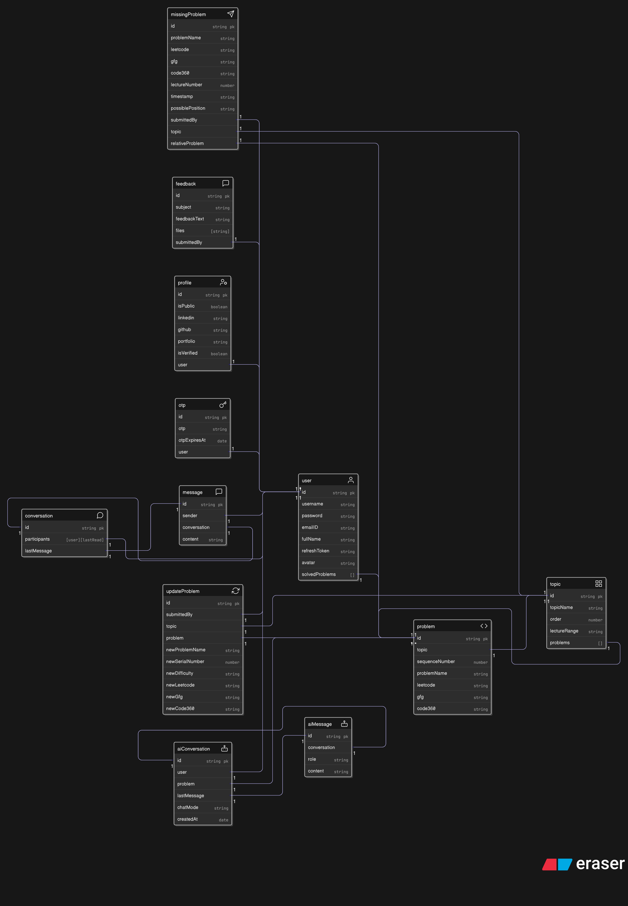

# 9.2 Designing the State Management and Information Flow

With the core AI concepts and database models established, the next critical step was to design a robust, end-to-end information flow for the AI chat system. This process began with mapping out the data flow on paper, identifying potential flaws, and then engineering a highly optimized architecture to ensure seamless and instantaneous user experience.

---

## The Frontend State: A Standardized Chat Object

The foundation of the frontend architecture is a standardized "chat object" that holds the complete state for any given AI conversation. The structure is as follows:

```json
{
  "history": [
    {
      "_id": "68b123...",
      "role": "user",
      "parts": [{ "text": "Hello AI" }]
    }
  ],
  "conversationId": "68b123...",
  "chatMode": "problemInterview",
  "problemId": "68b123..."
}
```

For general chat, the state uses this structure with `chatMode: "general"` and `problemId: null`.  
For problem-specific and interview mode chats, the structure is the same, but `chatMode` and `problemId` are set accordingly.  
In Redux, problem-specific and interview chats are stored in a Map-like object (or plain object), keyed by `problemId` for efficient lookup and retrieval.  
This consistent structure is used for all three chat modes, ensuring predictable and scalable state management.

---

### Data Flow: The Optimistic UI Pattern

A significant architectural decision was the adoption of an **Optimistic UI** pattern. This approach is designed to make the application feel extremely fast and responsive by updating the UI before waiting for the backend response.

### Flow 1: Fetching a Conversation

When a user opens an AI chat window, a single API call is made to the `/ai/session` endpoint. The backend intelligently determines whether to find an existing conversation (and its full message history) or create a new one, returning the complete, standardized chat object in one go.

#### Case 1.1 (General Chat, New Conversation):

- The frontend sends `chatMode` and `problemId` to the backend.
- If no conversation exists, the backend creates a new conversation and returns:
```js
{
  "history": [],
  "conversationId": "5555555555555",
  "chatMode": "general",
  "problemId": null
}
```

The backend returns the full history and metadata in the same structure, allowing the frontend to initialize the state with all previous messages.

**Case 2.1 & 2.2 (Problem-Specific/Interview Mode):**

The same logic applies, with the Redux state mapping `problemId` to the chat object for efficient access.

---

### Flow 2: Sending a Message (Optimistic Update)

When a user sends a message, the following steps occur:

#### 1. Instant Feedback (Optimistic UI)

- The frontend immediately dispatches an action that adds the user's message to the local Redux `history` array with a temporary `_id: null`.
- The user sees their message appear in the chat window instantly, without waiting for the server.

#### 2. Client-Authoritative History

- The frontend sends the entire updated `history` array to the backend's `/ai/message` endpoint.
- This designates the client as the "source of truth" for the AI's context, eliminating the need for the backend to fetch previous messages from the database before calling the AI. This reduces backend complexity and database load.

#### 3. Lightweight Backend Response

```js
{
  "userMessageId": "...",
  "aiMessage": { "_id": "...", "role": "model", ... }
}
```


The backend processes the request, obtains a response from the AI, and saves both the user's and the AI's messages to the database. It then sends back a minimal response containing only the data the frontend is missing.

### State Reconciliation

A Redux reducer on the frontend receives this response, locates the optimistic message in the `history` array (the one with `_id: null`), replaces the temporary ID with the permanent `userMessageId`, and appends the complete `aiMessage` object to the end of the history. As a result, the frontend state is kept perfectly in sync with the database.

### Detailed Case Handling

#### General Chat

- **Empty Chat:**  
  If the chat is empty, the backend creates a new conversation and returns an empty history.
- **Existing History:**  
  If history exists, the backend returns the full conversation, and the frontend initializes the state accordingly.

#### Problem-Specific and Interview Mode Chats

- The Redux state uses a Map (or object) to efficiently map each `problemId` to its chat object.
- The same fetch and update logic applies, ensuring each problem or interview session maintains its own isolated chat history.

#### Message Sending

- The frontend always provides immediate feedback by optimistically updating the UI.
- The backend only needs to return the new message IDs and the AI's response, minimizing payload size and processing time.

---

>This architecture is highly efficient, scalable, and user-centric. By standardizing the chat object, leveraging a Map-like structure for problem-specific chats, and implementing an Optimistic UI pattern, the system achieves:
>
>- Instantaneous user feedback with optimistic updates.
>- Reduced backend complexity by making the client authoritative for chat history.
>- Efficient data flow with minimal, targeted backend responses.
>- Perfect state synchronization between frontend and backend after each message.
>

