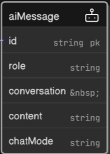

# 9.4 Problem-Specific AI Chat: The RAG Implementation

The problem-specific AI chat feature is a cornerstone of the AI Tutor, built on the **RAG (Retrieval-Augmented Generation)** architecture. Its implementation required solving complex data management, backend logic, and advanced frontend UI challenges.

---

## Data Integrity Challenge: From Orphaned Data to a Self-Cleaning System

A significant architectural issue was discovered late in development: the initial plan was to use a TTL (Time-To-Live) index to delete the `AiConversation` "header" document after 24 hours. However, this would have left all associated `AiMessage` documents "orphaned" in the database, creating a major data integrity problem.

### Understanding MongoDB TTL Indexes

A TTL index in MongoDB can only be a single-field index on a date field. The initial attempt used a compound index (`{ type: 1, createdAt: 1 }`), which does **not** work for TTL. The correct approach is a single-field index:

```js
aiConversationSchema.index({ createdAt: 1 }, { ... })
```

The Conditional TTL Index Solution
To solve the orphaned data problem and ensure only the right messages are deleted, the TTL index was moved to the `AiMessage` **model**. Using MongoDB's `partialFilterExpression`, a "conditional" TTL index was created:

```js
aiMessageSchema.index(
   { "createdAt": 1 },
   {
      expireAfterSeconds: 86400, // 24 hours
      partialFilterExpression: { chatMode: { $in: ['general', 'problemSpecific'] } }
   }
);
```

This ensures that only messages in 'general' or 'problemSpecific' chat modes are deleted after 24 hours, while messages in 'problemInterview' mode remain permanent. This approach creates a robust, self-cleaning system with zero maintenance.

## Model Logic and Strategies for Message Deletion

A further logical issue was identified: deleting only the conversation document would leave behind orphaned messages. The solution was to delete only messages belonging to conversations in the relevant modes, not the conversation itself. Two strategies were considered:

### Strategy 1: Event-Driven Deletion

Delete all old messages in a batch when a new message arrives. This adds complexity and potential performance overhead to the most frequently used function (`sendMessageToAI`).

### Strategy 2: Continuous, Rolling Deletion

Each message self-destructs after 24 hours, handled by MongoDB's background process. This is simple, efficient, and requires no extra application logic.

**Strategy 2 was chosen for its simplicity, efficiency, and seamless user experience.**



---

## Frontend: Advanced UI Engineering in ProblemChatModal and ProblemAiChatWindow

The frontend implementation demonstrates advanced UI engineering, featuring:

- **Invisible Prompt:**  
  To create the effect that the AI initiates the conversation, the backend generates a system prompt as the first message. The frontend renders messages starting from the second message (`messages.slice(1).map(...)`), hiding the system prompt from the user.

- **Proactive AI Response:**  
  A `useEffect` detects when a new chat history contains only the invisible prompt and automatically triggers the `sendMessageToAI` action, making the AI appear to respond first.

- **Mode Switching:**  
  Users can toggle between "General Discussion" and "Interview Mode" for the same problem. The component fetches chat history for a new mode only if it isn't already cached in Redux, optimizing performance.

- **Advanced UI Features:**
  - Custom animated loading indicators.
  - Expandable message cards for long AI responses.
  - A dynamic modal that uses a `ResizeObserver` to adapt its size based on the main application's sidebar state.
  - Glassmorphism effects and modern header design.
  - Markdown rendering and syntax highlighting in messages.
  - "Restore Checkpoint" feature for message cards.
  - Optimistic UI for instant feedback.

---

## Code Review and Analysis

### Sophisticated State Management

- **Mode Switching (`handleToggleMode`):**  
  Efficiently switches modes, fetching history only when needed.

- **Smart Data Fetching:**  
  Uses `useEffect` to dispatch `getAiChatHistory` only when necessary, preventing redundant API calls.

- **Proactive AI Initiation:**  
  Automatically triggers the first AI response when the chat is initialized.

### Advanced UI/UX Features

- **MessageCard Component:**  
  Handles Markdown, syntax highlighting, expandable/collapsible long messages, and "Restore Checkpoint" functionality.

- **Expandable Messages:**  
  Measures message height and provides a "Show More/Less" chevron for long responses.

- **Modern UI Design:**  
  Includes animated loading, glassmorphism, and responsive modal sizing.

### Invisible Prompt Implementation

- **Implementation:**  
  `messages.slice(1).map(...)` hides the system prompt, creating a seamless AI-initiated chat experience.

---

## Review of ProblemAiChatWindow.jsx and ProblemChatModal.jsx

- **Modular Design:**  
  Message rendering is separated into `MessageCard`, keeping the main chat window focused on state and logic.

- **Advanced State Management:**  
  Manages multiple pieces of state (`newMessage`, `showEmojiPicker`, `expandedArr`) using `useState` and `useRef`.

- **Invisible Prompt Logic:**  
  Uses `useEffect` and `lastAutoSentRef` to ensure the AI's auto-send only happens once per session.

- **Mode Toggling:**  
  Checks Redux cache before fetching new data, optimizing performance.

- **Expandable Messages:**  
  Provides a collapsible view for long messages.

- **Dynamic Sizing in ProblemChatModal:**  
  Uses `ResizeObserver` to adjust modal width and margin based on sidebar state, ensuring perfect layout.

- **Clear UX Flow:**  
  Presents chat mode options intuitively and conditionally renders the chat window.

---

## Engineering Journey and Skills Demonstrated

The development process involved:

- Debugging Markdown rendering and state management.
- Using Redux DevTools and console logs to trace state.
- Comparing code against previous commits for regression testing.
- Architecting a modular Redux slice and using advanced React hooks (`useRef`, `useLayoutEffect`) for UI interactions.

This feature demonstrates:

- The ability to architect complex state and UI.
- Implementation of advanced UI/UX features.
- Debugging of asynchronous and real-time behavior.
- Writing clean, modular, and performant React code.

---

>The RAG-powered problem-specific AI chat is not just a chat interface—it's a multi-modal, context-aware AI tutor with a real-time, professional-grade UI. The solution spans from database schema design to pixel-perfect frontend engineering, showcasing advanced skills in both backend and frontend development.
>
>This feature is a highlight of the application that includes:
>
>- Data integrity and self-cleaning systems with MongoDB TTL indexes.
>- Efficient, maintainable backend logic.
>- Sophisticated, user-friendly, and performant frontend architecture.
>
>With this, the application achieves a truly feature-complete, modern AI-powered user experience.