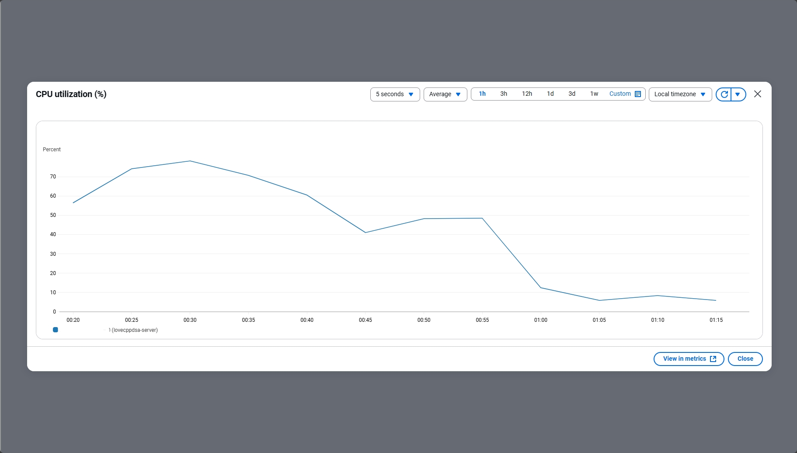

# 10.4 The Manual Deployment Journey

When I set out to deploy my application for the first time, I wanted to truly understand what happens under the hood. So, I decided to go through the entire process manually, step by step, on a real cloud server (an AWS EC2 instance). This hands-on approach taught me a lot about deployment, security, and the limitations of small cloud machines. Every step was a learning experience, and I made sure to note every detail and challenge I faced along the way.

---


## Step 1: Installing Git

First, I needed to make sure the `git` command was available on my new server. On the EC2 instance, I ran:

```bash
sudo apt install git -y
```

---


## Step 2: Cloning My GitHub Repository

Next, I needed to clone my code from GitHub onto the server. Here’s how I did it:

1. In my web browser, I went to my main GitHub repository page for the `lovecppdsa` project.
2. I clicked the green **"Code"** button.
3. I made sure the **HTTPS** tab was selected, and copied the URL (something like `https://github.com/my-username/lovecppdsa.git`).
4. Back in the EC2 server’s terminal, I ran:

```bash
git clone https://github.com/my-username/lovecppdsa.git
```

This command downloaded my entire project from GitHub into a new folder called `lovecppdsa` on the server. I used `ls` to confirm the files and folders were there.

---

But then I hit my first real-world deployment problem: my repository was private, so the `git clone https://...` command failed with a permissions error. My EC2 server needed a way to prove to GitHub that it had permission to access the code.

### The Private Repo Question: How Does the Server Get the "Secret Recipes"?

I learned that the most secure way to do this is with a **Deploy Key**. A deploy key is like giving my server its own unique, special-purpose key that only unlocks the door to my `lovecppdsa` "recipe book" (the GitHub repository). This is much more secure than using my personal GitHub credentials.

Here’s exactly how I set it up:

#### Step 1: Generate a New SSH Key Pair (On the EC2 Server)

```bash
ssh-keygen -t rsa -b 4096 -C "my_github_email@example.com"
```
- I accepted the default file location and left the passphrase empty for automation.

#### Step 2: Get the Public Key

```bash
cat ~/.ssh/id_rsa.pub
```
- I copied the entire output (starting with `ssh-rsa`).

#### Step 3: Add the Deploy Key to GitHub

1. I went to my private `lovecppdsa` repository on GitHub.
2. Clicked on **Settings** > **Deploy keys** > **Add deploy key**.
3. Gave it a memorable name (like `EC2 Server Key`), pasted the public key, and made sure **not** to allow write access (read-only is safest).
4. Clicked **Add key**.

#### Step 4: Clone Using the SSH URL

Back in the repo’s main page, I selected the **SSH** tab under the **Code** button, copied the SSH URL (starting with `git@github.com...`), and ran:

```bash
git clone git@github.com:my-username/lovecppdsa.git
```

This time, the server securely cloned my private repository. I learned that using deploy keys is the best practice for production servers.

---


## Step 3: Managing Secrets on the Server

After cloning, I immediately noticed that my `.env` file (with secrets and environment variables) was missing. Of course, this made sense—it's not in the repo for security reasons. I needed to create it manually on the server.

Here’s how I did it:

1. Navigated to the backend folder:
   ```bash
   cd ~/lovecppdsa/loveCppDsa_Backend
   ```
2. Created and opened the `.env` file with nano:
   ```bash
   nano .env
   ```
3. On my local computer, I opened my `loveCppDsa_Backend/.env` file and copied all its content.
4. Back in the EC2 terminal (in nano), I pasted the content. (Right-click or `Ctrl+Shift+V` worked for me.)
5. Saved and exited nano (`Ctrl+X`, then `Y`, then `Enter`).

Now my secure `.env` file was in place on the server.

---


## Step 4: The "Build in the Garage" Experience

With everything in place, I was ready to build and run the application using Docker Compose. This was my first time doing a "manual build in the garage"—a true hands-on deployment.

```bash
cd ~/lovecppdsa
docker compose up --build -d
```

This command reads the `docker-compose.yml`, builds the frontend and backend images, and starts both containers in the background. I was excited to see my application come to life on the internet for the first time.

---


### The First Major Roadblock: Permissions

But then I hit a classic Docker error:

```
unable to get image 'lovecppdsa-frontend': permission denied while trying to connect to the Docker daemon socket
```

I realized this was a Linux permissions issue—my user didn’t have access to the Docker daemon. The quick fix was to run:

```bash
sudo docker compose up --build -d
```

This worked, but I learned that it’s not ideal to use `sudo` for every Docker command. The real solution is to add my user to the `docker` group and start a new login session, but for now, `sudo` got the job done.

---


### The Second Major Roadblock: The Small Engine Problem

As the build process started, I quickly realized how slow it was. My EC2 `t2.micro` instance (AWS Free Tier) has very limited CPU and RAM. The `npm install` and `COPY . .` steps in the Docker build pegged the CPU at 80% and then seemed to stall. After a while, CPU usage dropped to 8%—a sign the server had run out of memory and was now stuck.

This was a huge learning moment for me. Building Docker images on a tiny cloud server is like trying to build a sports car in a small garage with hand tools. It works, but it's slow and inefficient. I watched the CPU utilization graph in the AWS console drop from 80% to 8% and realized the server was no longer "thinking"—it was just stuck, likely out of RAM.



---


## Key Takeaways and What I Learned

- Manual deployment is a fantastic way to learn, but it’s not scalable for production.
- Deploy keys are the secure way to give a server access to a private repo—never use your personal credentials.
- Secrets (`.env` files) must be managed carefully and never committed to source control.
- Building Docker images on a small server is slow and can fail due to resource limits. Watching the CPU and memory usage in real time taught me a lot about the limitations of cloud resources.
- CI/CD pipelines and pre-built images are not just "nice to have"—they are absolutely necessary for real-world deployments. This manual process made me appreciate the value of automation and professional workflows.

This experience set the stage for moving to a professional, automated deployment workflow using CI/CD and Docker Hub. I now understand, from first-hand experience, why these tools are so important.